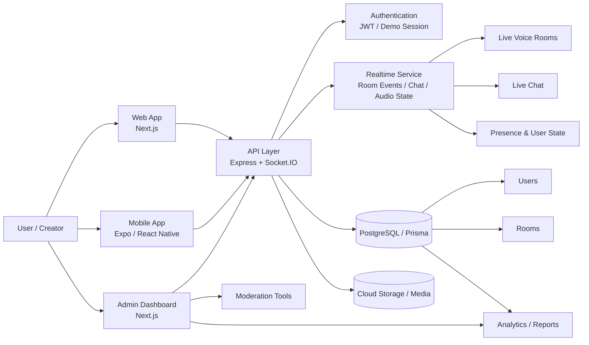

```markdown name=docs/architecture.md
# WevoTok Architecture Overview


```

## Flow summary

- Web and mobile clients connect to the API and Realtime socket service.
- Authentication verifies user identity and assigns session metadata.
- Socket events manage room joins, chat, mic state, and presence.
- PostgreSQL stores persistent user, room, billing, moderation, and analytics data.
- Admin dashboard uses aggregated metrics and moderation tools for platform operations.

## Production upgrade path

- Add WebRTC signaling and media servers for live voice transport.
- Introduce Redis for pub/sub and high-frequency presence state.
- Add role-based access control for moderators and admins.
- Add CDN and object storage for avatars, voice clips, and media assets.
